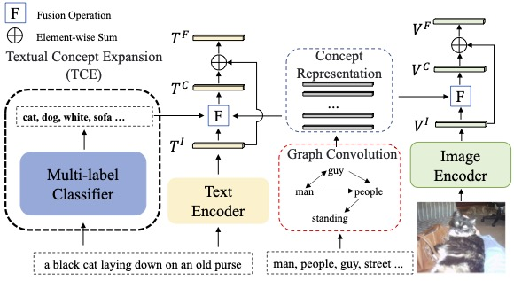

# TCE-CVSE
Code for the ACM MM 2023 paper: Textual Concept Expansion with Commonsense Knowledge to Improve Dual-Stream Image-Text Matching.
We borrow the code from ["CVSE"](https://github.com/BruceW91/CVSE) and ["Multi-label Text Classification with BERT and PyTorch Lightning"](https://curiousily.com/posts/multi-label-text-classification-with-bert-and-pytorch-lightning/)



## Requirements and Installation
Python 3.6
PyTorch 1.1.0
NumPy (>1.12.1)
TensorBoard
torchtext
pycocotools
pytorch-lightning 1.2.8
transformers 4.5.1 

## Data
Download the dataset created by [SCAN](https://github.com/kuanghuei/SCAN):
```
wget https://iudata.blob.core.windows.net/scan/data.zip
wget https://iudata.blob.core.windows.net/scan/vocab.zip
```

First, please download the [stanford-postagger](https://nlp.stanford.edu/software/tagger.shtml) and put it into './stanford-postagger'.
The concepts vocabulary and other train data are generated by ```generate_vocab.py```:

```
python generate_vocab.py
```

The train data for multi-label classifer is generate by ```ML-Classifier/data/coco_data.py```

## Train the model
Train our model on SLURM: 'sbatch tce_run_with_slurm_das_train.sh'.

```
DATA_PATH="./data/coco_annotations/Concept_annotations_coco_vocab"
LOG_PATH="./runs/coco_new/"

srun python train_coco.py --data_path "../../data/scan_data/data" \
  --batch_size 512 \
  --num_attribute 300 \
  --model_name "$LOG_PATH/CVSE_COCO_data_omp_train_top_300_five_caption/" \
  --concept_name "$DATA_PATH/data_omp_train_top_300_five_caption/category_concepts.json" \
  --inp_name "$DATA_PATH/data_omp_train_top_300_five_caption/coco_concepts_glove_word2vec.pkl" \
  --resume "none" \
  --adj_file "$DATA_PATH/data_omp_train_top_300_five_caption/coco_adj_concepts.pkl" \
  --adj_gen_mode "ReComplex" \
  --t 0.3 \
  --alpha 0.9 \
  --attribute_path "$DATA_PATH/data_omp_train_top_300_five_caption/" \
  --test_on "five" \
  --re_weight 0.2 \
  --logger_name "$LOG_PATH/CVSE_COCO/data_omp_train_top_300_five_caption_prediction/"
```

## Evaluation
Test our model on SLURM.
Generate the Textual Concept Expansion by: 
```sbatch ml_run_with_slurm_das_test.sh```

We upload our model [here](https://drive.google.com/drive/folders/1Gq1VRDnTJnkxTwLs3dE16YHw4JObm6Nl?usp=sharing). You can download them and put them into the model directory.
Test the model by:
```sbatch tce_run_with_slurm_das_test.sh```

## Citation


